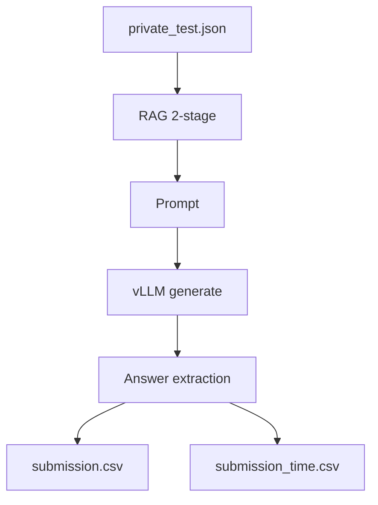

# HackAIthon 2026 Bảng C

Hệ thống AI Trắc nghiệm sử dụng **RAG 2 chặng** (Retrieval + Reranking) kết hợp **vLLM** để suy luận đáp án và xuất kết quả theo định dạng BTC.

## Pipeline Flow

1. **INPUT (private test)**
   - Đọc file: `/code/private_test.json`
   - Mỗi sample chứa `qid` và `question` (code có fallback để tìm key trong cấu trúc JSON lồng).

2. **RAG 2 chặng (2-stage retrieval)**
   - **Chặng 1 (Vector Retrieval - BGE-M3)**: mã hóa câu hỏi và lấy các chunk liên quan theo cosine similarity.
   - **Chặng 2 (Semantic Reranking - Qwen-Rerank)**: rerank các ứng viên và chọn top-k tài liệu tốt nhất để nhét vào prompt.

3. **Prompting (Reflective CoT format)**
   - Ghép context RAG + câu hỏi vào prompt yêu cầu output phải kết thúc bằng dòng:
     - `Đáp án: X` (X ∈ A/B/C/D)

4. **LLM Inference (vLLM on GPU)**
   - vLLM load model và sinh output cho **mỗi câu hỏi**.
   - Code đo **thời gian suy luận theo từng sample**.

5. **Answer Extraction (3-layer fallback regex)**
   - Layer 1: khớp trực tiếp `Đáp án: X`
   - Layer 2: khớp các mẫu ngôn ngữ như `chọn/là X`
   - Layer 3: lấy ký tự ABCD xuất hiện sau cùng

6. **OUTPUT (2 file riêng biệt)**
   - `/code/output/submission.csv` (cột: `qid,answer`)
   - `/code/output/submission_time.csv` (cột: `qid,answer,time`)

Sơ đồ minh họa:

## Data Processing

- **Load JSON**
  - Đọc bắt buộc từ: `/code/private_test.json`
  - Nếu JSON là dict lồng nhau: code sẽ cố gắng tìm các key phổ biến (data/items/questions/...) hoặc **deep scan** để tìm object có `qid` và `question` (hoặc `query`).

- **Normalize**
  - Chuẩn hóa về danh sách `(qid, question)`.
  - Bỏ qua sample thiếu `qid`/`question` hoặc `question` rỗng.

- **RAG Context**
  - `RAGSystem.search(question, top_k=2)` trả về chuỗi context (ghép top-k chunk tốt nhất) được đưa vào prompt.

- **Time Measurement**
  - Với từng `(qid, question)`:
    - `start = time.perf_counter()`
    - gọi `llm.generate([prompt], ...)`
    - `end = time.perf_counter()`
    - ghi `time = end - start`

## Resource Initialization (Vector DB + GPU Model)

- **Knowledge Base / Vector indexing**
  - `RAGSystem(kb_path="knowledge_base.txt")`:
    - Đọc `knowledge_base.txt`
    - Chunk hóa (CHUNK_SIZE=200, overlap=50)
    - Tính embedding cho toàn bộ chunk bằng **BGE-M3** (cache trong RAM/CPU theo vòng init)

- **Reranking model**
  - `FlagReranker("Qwen/Qwen-Rerank")` được nạp khi khởi tạo `RAGSystem`.

- **GPU LLM loading (vLLM)**
  - `LLM(model="Qwen/Qwen1.5-7B-Chat", gpu_memory_utilization=0.9, max_model_len=2048, trust_remote_code=True)`
  - Tham số decoding:
    - `temperature=0.0`
    - `max_tokens=256`

## How to run (Docker)

- Build:
  - `docker build -t btc-rag .`
- Run (ví dụ):
  - Mount file private test vào `/code/private_test.json`
  - `docker run --gpus all -v <host-private_test.json>:/code/private_test.json btc-rag`

Sau khi chạy, hệ thống sẽ tạo:
- `/code/output/submission.csv`
- `/code/output/submission_time.csv`

